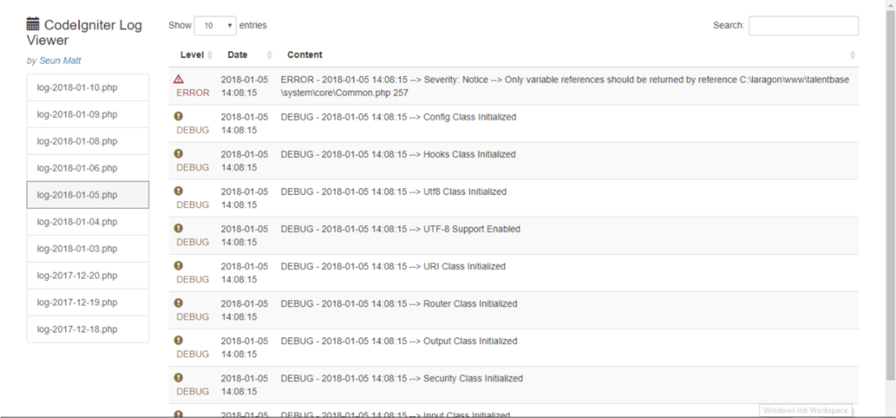

CodeIgniter Log Viewer
=======================

[](https://packagist.org/packages/seunmatt/codeigniter-log-viewer) [](https://packagist.org/packages/seunmatt/codeigniter-log-viewer) [](https://packagist.org/packages/seunmatt/codeigniter-log-viewer) 

This is a simple Log Viewer for viewing CodeIgniter logs in the browser or via API calls (that returns a JSON response)

This project is inspired by the [laravel-log-viewer project](https://github.com/rap2hpoutre/laravel-log-viewer).

A typical log view looks like this:



Usage
=====

Requirement
-----------
- PHP >= 7.1

Composer Installation
---------------------
Execute:

```
composer require seunmatt/codeigniter-log-viewer
```

Controller Integration for Browser Display
------------------------------------------


All that is required is to execute the `showLogs()` method in a Controller that is mapped to a route:

A typical Controller *(LogViewerController.php)* will have the following content:

```php
private $logViewer;

public function __construct() {
    parent::__construct(); 
    $this->logViewer = new \CILogViewer\CILogViewer();
    //...
}

public function index() {
    echo $this->logViewer->showLogs();
    return;
}
```

Then the route *(application/config/routes.php)* can be configured thus:

```php
$route['logs'] = "logViewerController/index";
```

And that's all! If you visit `/logs` on your browser 
you should see all the logs that are in *application/logs* folder and their content


Configuration
==============

- The folder path for log files can be configured by adding `clv_log_folder_path` to CodeIgniter's `config.php` file e.g.

`$config["clv_log_folder_path"] = APPPATH . "logs";` 

- The file pattern for matching all the log files in the log folder can be configured by adding
 `clv_log_file_pattern` to CodeIgniter's `config.php` file e.g.

`$config["clv_log_file_pattern"] = "log-*.php";`


Viewing Log Files via API Calls
===============================

If you're developing an API Service, powered by CodeIgniter, this library can still be used to view your log files.

Controller Setup
----------------
**The setup is the same as that mentioned above:** 
 - Create a Controller e.g. `ApiLogViewerController.php`, 
 - Create a function e.g. `index()`
 - In the function, call `echo $this->logViewer->showLogs();`
 - Finally, map your controller function to a route.
 
 API Commands
 ------------
 
 The API is implemented via a set of query params that can be appended to the `/logs` path.
 
 Query:
 
 - `/logs?api=list` will list all the log files available in the configured folder

Response:

 ```json
{
    "status": true,
    "log_files": [
        {
            "file_b64": "bG9nLTIwMTgtMDEtMTkucGhw",
            "file_name": "log-2018-01-19.php"
        },
        {
            "file_b64": "bG9nLTIwMTgtMDEtMTcucGhw",
            "file_name": "log-2018-01-17.php"
        }
    ]
}
```

**file_b64 is the base64 encoded name of the file that will be used in further operations and API calls**
 
 Query:
 
 - `/logs?api=view&f=bG9nLTIwMTgtMDEtMTcucGhw` will return the logs contained in the log file specified by the `f` parameter. 
 
 The value of the `f` (*f stands for file*) is the base64 encoded format of the log file name. It is obtained from the `/logs?api=list` API call. 
 A list of all available log files is also returned.
 
 Response:
 
 ```json
 {
     "log_files": [
         {
             "file_b64": "bG9nLTIwMTgtMDEtMTkucGhw",
             "file_name": "log-2018-01-19.php"
         },
         {
             "file_b64": "bG9nLTIwMTgtMDEtMTcucGhw",
             "file_name": "log-2018-01-17.php"
         }
     ],
     "status": true,
     "logs": [
         "ERROR - 2018-01-23 07:12:31 --> 404 Page Not Found: admin/Logs/index",
         "ERROR - 2018-01-23 07:12:37 --> 404 Page Not Found: admin//index",
         "ERROR - 2018-01-23 15:23:02 --> 404 Page Not Found: Faviconico/index"
     ]
 }
 ```
 
 The API Query can also take one last parameter, `sline` that will determine how the logs are returned
 When it's `true` the logs are returned in a single line:
 
 Query:
 
 `/logs?api=view&f=bG9nLTIwMTgtMDEtMTkucGhw&sline=true`
 
 Response:
 
 ```json
{
    "log_files": [
        {
            "file_b64": "bG9nLTIwMTgtMDEtMTkucGhw",
            "file_name": "log-2018-01-19.php"
        },
        {
            "file_b64": "bG9nLTIwMTgtMDEtMTcucGhw",
            "file_name": "log-2018-01-17.php"
        }
    ],
    "status": true,
    "logs": "ERROR - 2018-01-23 07:12:31 --> 404 Page Not Found: admin/Logs/index\r\nERROR - 2018-01-23 07:12:37 --> 404 Page Not Found: admin//index\r\nERROR - 2018-01-23 15:23:02 --> 404 Page Not Found: Faviconico/index\r\n"
}
```
 
 
 When it's `false` (**Default**), the logs are returned in as an array, where each element is a line in the log file:

Query:

 `/logs?api=view&f=bG9nLTIwMTgtMDEtMTkucGhw&sline=false` OR `logs?api=view&f=bG9nLTIwMTgtMDEtMTkucGhw` 

Response:
 
 ```json
{
    
    "logs": [
        "ERROR - 2018-01-23 07:12:31 --> 404 Page Not Found: admin/Logs/index",
        "ERROR - 2018-01-23 07:12:37 --> 404 Page Not Found: admin//index",
        "ERROR - 2018-01-23 15:23:02 --> 404 Page Not Found: Faviconico/index"
    ]
}
```
 
Query:

`/logs?api=delete&f=bG9nLTIwMTgtMDEtMTkucGhw` will delete a single log file. The **f** parameter is the base64 encoded name of the file
and can be obtained from the view api above.

Query: 

`/logs?api=delete&f=all` will delete all log files in the configured folder path. Take note of the value for **f** which is the literal '**all**'.
 
 **IF A FILE IS TOO LARGE (> 50MB), YOU CAN DOWNLOAD IT WITH THIS API QUERY `/logs?dl=bG9nLTIwMTgtMDEtMTcucGhw`**
 
 
SECURITY NOTE
=============
**It is Highly Recommended that you protect/secure the route for your logs. It should not be an open resource!**


Contributions
=============

**Love this library? You can support by [buying me a coffee](http://wallet.ng/pay/ossmatt)** :coffee:

Found a bug? Kindly create an issue for it. 

Want to contribute? Submit your pull-request(s)

Remember to :star: star the repo and share with friends

Author
======
Made with :heart: by [Seun Matt](https://smattme.com)

CHANGELOG
=========
[Changelog](CHANGELOG.md)

LICENSE
=======
[MIT](LICENSE)
